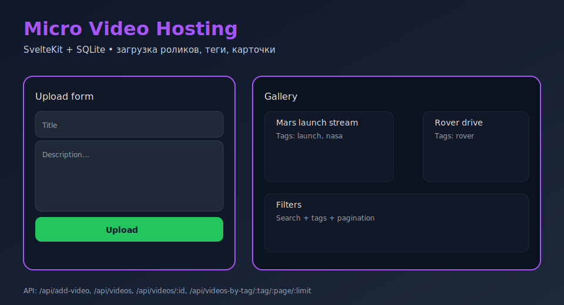

# Micro Video Hosting (SvelteKit + SQLite)



Мини-хостинг видео на SvelteKit/SQLite: загрузка роликов, теги, просмотр и фильтр по тегам. API на file-based endpoints, хранение в `mydatabase.db`, загрузка файлов в `static/videos`.

## Запуск

```bash
pnpm install   # или npm/yarn
cp .env.example .env
pnpm dev
```

По умолчанию база `mydatabase.db` создаётся рядом с проектом. Видео складываются в `static/videos`.

## API/функционал

- `POST /api/add-video` — загрузка видео (FormData: `title`, `description`, `tags[]`, `video_file`).
- `GET /api/videos` — все видео с тегами.
- `GET /api/videos/:id` — карточка с тегами.
- `GET /api/videos-by-tag/:tag/:page/:limit` — пагинация по тегу.
- `GET /api/tags` — список всех тегов.
- `GET /api/home` — последние 6 видео.

### Примеры

```bash
# создать ролик
curl -F "title=Demo" -F "description=short" -F "tags[]=nasa" -F "video_file=@demo.mp4" \
  http://localhost:5173/api/add-video

# список роликов и конкретный id
curl http://localhost:5173/api/videos
curl http://localhost:5173/api/videos/1

# ролики по тегу
curl http://localhost:5173/api/videos-by-tag/nasa/1/10
```

## Разработчику

- База и таблицы создаются автоматически при старте.
- Настрой `BASE_URL` в `.env` для отдачи файлов (используется на страницах просмотра).
- Тесты: Vitest + @testing-library/svelte (`npm test`) покрывают домашнюю страницу загрузки.
- Линт: ESLint + Prettier (`npm run lint`, `npm run format`).

## Билд

```bash
pnpm build
pnpm preview
```

## Quality

- Линт/формат: `npm run lint`, `npm run format`
- Тесты: `npm test` (Vitest, jsdom)
- CI: GitHub Actions (`ci.yml`) — lint + tests on Node 18.
